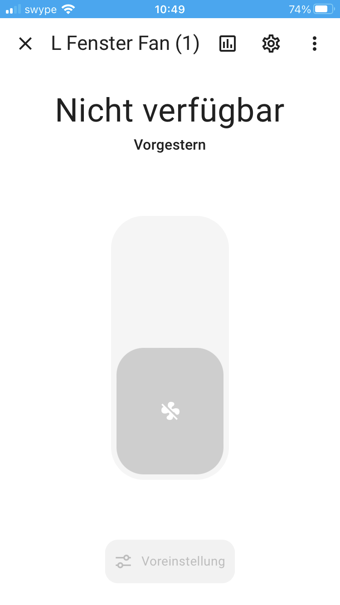

## Beschreibung
Dies ist ein Matter Repository, welches einen ESP32 zur Ansteuerung von zwei Lüfter verwendet. Über den untenstehenden QR-Code kann man das Gerät bei Home Assistant als Matter-Gerät einbinden.



## Hardware Komponenten
- ESP-WROOM-32
- IRLB8721PBF (2 Stk)
- Widerstände
    - 560 Ohm (für die LED)
    - 10 kOhm (3 Stk)
    - 100 Ohm (2 Stk)
- 12 Volt Netzteil
- Buck Converter von 12V auf 5V (für den ESP32)
- Noisblocker XR2 - Lüfter (2 Stk)
- LED
- Taster

## Features
- Ansteuerung von zwei Lüftern.
- Integration als Matter-Gerät.
- LED-Anzeige für Kommissionierungsstatus.
- Einfacher Reset durch Taster.

## Aufbauanleitung
1. Verbinde die Hardware gemäß dem Schaltplan im Ordner `docs`.
2. Installiere die ESP-IDF, ESP-MATTER und ESP-IDF-LIB.
3. Lade den Code hoch, wie es in in der [Kommissionierung](#kommissionierung) beschrieben ist.

## Nutzung
Nach der Kommissionierung mit dem QR-Code können die Messwerte direkt in Home Assistant angezeigt werden.

## Kommissionierung
Wenn man einen anderen Microcontroller verwendet, als es oben in den Hardware Komponenten beschrieben ist, dann muss man zuerst `idf.py set-target` ausführen. Wenn man diesen Befehl ausführt, werden alle Werte in der `idf.py menuconfig` zurückgesetzt und man muss folgende Schritte ausführen.Im Menüpunkt `GPIO Configuration` können die GPIO's angepasst werden.
1. Öffnen Sie das Konfigurationsmenü mit `idf.py menuconfig`
2. **Enable ESP32 Factory Data Provider**  
   Pfad: `Component config → CHIP Device Layer → Commissioning options → Use ESP32 Factory Data Provider`  
   Aktivieren Sie die Konfigurationsoption `CONFIG_ENABLE_ESP32_FACTORY_DATA_PROVIDER`, um die ESP32-spezifische Implementierung von `CommissionableDataProvider` und `DeviceAttestationCredentialsProvider` zu nutzen.
3. **Enable ESP32 Device Instance Info Provider**  
   Pfad: `Component config → CHIP Device Layer → Commissioning options → Use ESP32 Device Instance Info Provider`  
   Aktivieren Sie die Konfigurationsoption `ENABLE_ESP32_DEVICE_INSTANCE_INFO_PROVIDER`, um Geräteinformationen aus der Factory-Partition zu beziehen.
4. **Enable Attestation - Factory**  
   Pfad: `Component config → ESP Matter → DAC Provider options → Attestation - Factory`
5. **Set chip-factory namespace partition label**  
   Pfad: `Component config → CHIP Device Layer → Matter Manufacturing Options → chip-factory namespace partition label`  
   Setzen Sie die Konfigurationsoption `CHIP_FACTORY_NAMESPACE_PARTITION_LABEL`, um das Label der Partition zu wählen, in der Schlüssel-Werte im "chip-factory"-Namespace gespeichert werden. Standardmäßig ist das gewählte Partitionslabel `nvs`. _Anmerkung_: Am besten belässt man den Standardewrt.
6. **Change Vendor ID & Device Product ID**  
   Pfad: `Component config → CHIP Device Layer → Device Identification Options`  
   Setzen Sie folgende Werte:
   - **Vendor ID:** `0xFFF2`
   - **Device ID:** `0x8001`
7. **Erstellen einer Factory Partition**
   Dies wurde schon gemacht und sollte nicht wiederholt werden - Die Dateien finden sich im Ordner `./out/`. Eine genauere Anleitung dazu, wie man dies macht und damit auch die QR-Codes erzeugt findet im Ordner `docs`.
8. **Flashen der Manufacturing-Binary**
    1. Flash-Speicher löschen:
    ```idf.py -p /dev/ttyACM0 erase-flash```
    2. Firmware flashen:
    ```idf.py -p /dev/ttyACM0 flash```
    3. Flashen des Binary-Bildes auf das Gerät, welches in Schritt 7. erstellt worden ist und in diesem Repo schon vorhanden ist.
    ```esptool.py -p <serial_port> write_flash <address> path/to/<uuid>-partition.bin```
    **HINWEIS:** Zuerst muss die App-Firmware geflasht werden, gefolgt von der benutzerdefinierten Partition-Binary. Die Manufacturing-Binary muss an der entsprechenden Adresse der konfigurierten Factory-Partition geflasht werden, die durch `CHIP_FACTORY_NAMESPACE_PARTITION_LABEL` festgelegt wird (Standard: `nvs`).

    **Parameter:**
    - **`serial_port`**: Wahrscheinlich `/dev/ttyACM0` oder `/dev/TTYUSB0`.
    - **`address`**: Standardmäßig `0x10000`, falls das Partitionslabel nicht geändert wurde. Es wird empfohlen, das Partitionslabel unverändert zu lassen.
    - **`path/to/uuid-partition.bin`**: Die Partition-Binärdatei befindet sich im `out`-Ordner. Verwenden Sie eine Suchfunktion, um sie zu finden.
9. Nun sollte die LED blinken und damit anzeigen, dass das Gerät bereit ist mit dem untenstehenden QR-Code kommissioniert zu werden.


